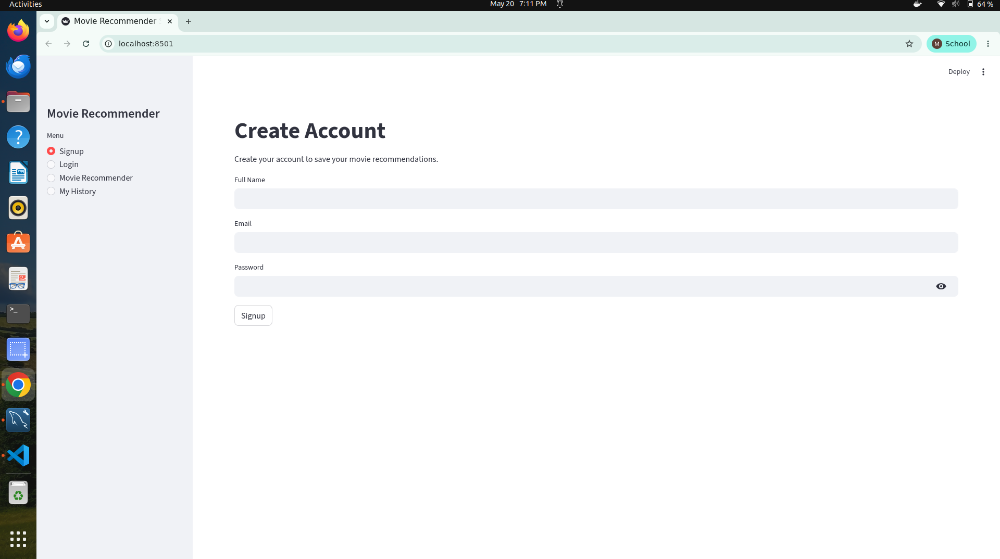
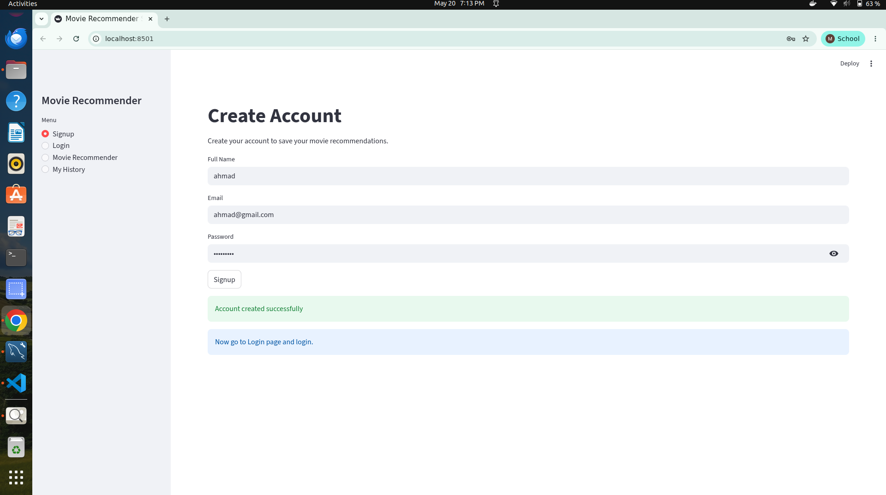
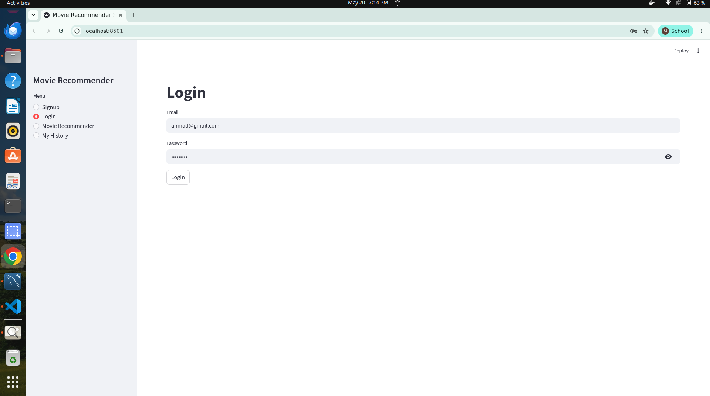
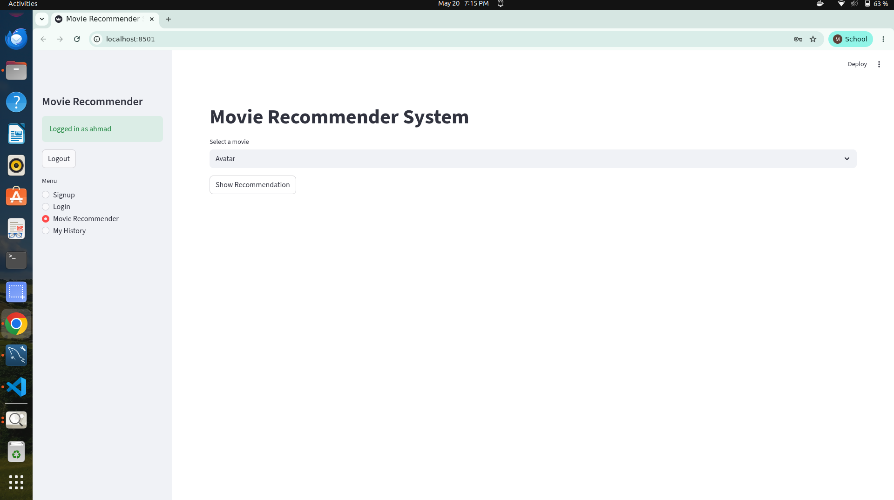
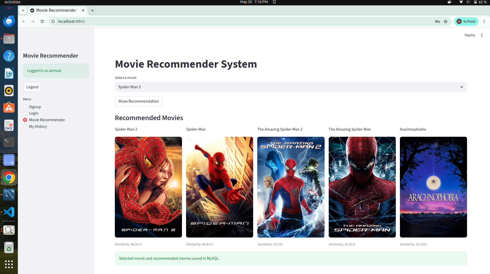
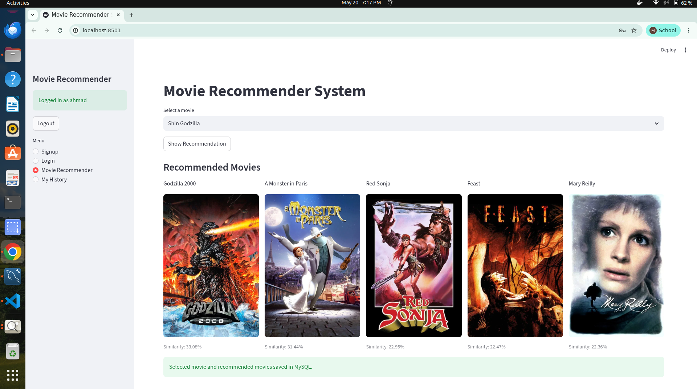
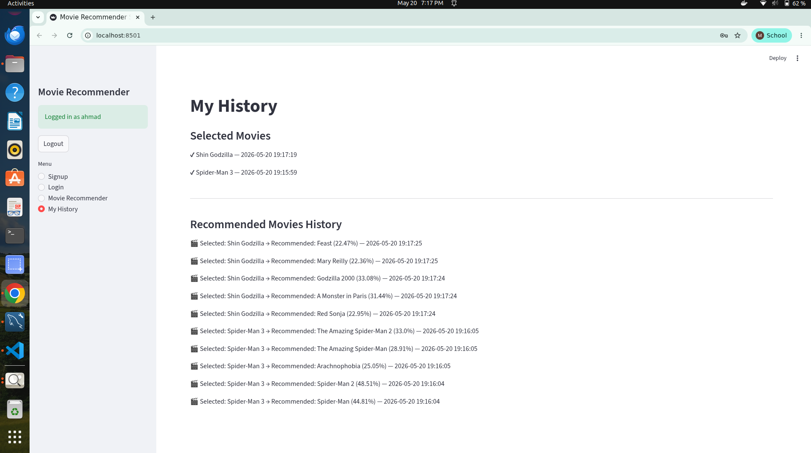
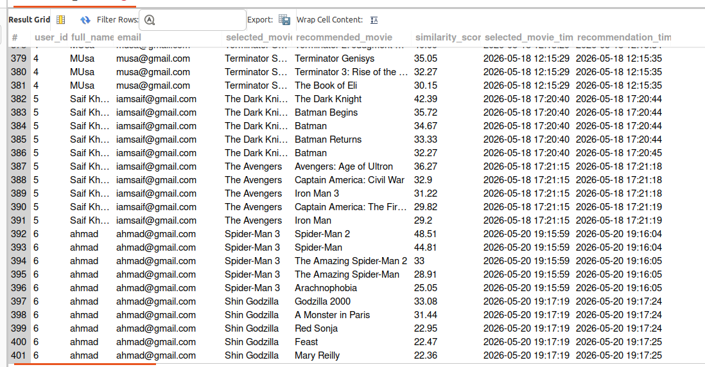

#  Movie Recommender System — Streamlit + Machine Learning + MySQL

A clean and interactive movie recommendation web application built with **Python**, **Streamlit**, **Pandas**, **Pickle**, **MySQL**, and **The Movie Database API**.

This project allows users to create an account, login, select a movie, and get similar movie recommendations with posters and similarity scores. The system also stores the user’s selected movies and recommendation history in a MySQL database.

---

##  Project Overview

The **Movie Recommender System** is designed to help users discover movies similar to the one they already like.

Users can:

- Create a personal account
- Login securely
- Select a movie from the available dataset
- Get top movie recommendations
- View movie posters using TMDB API
- See similarity percentage for each recommendation
- Save selected movies automatically
- Track recommendation history inside the app

The project uses a precomputed similarity model to quickly recommend movies based on content similarity.

---

##  Project Screenshots

Below are the working screenshots of the **Movie Recommender System** application.

---

### 1. Application Screen


---

### 2. Signup Screen


---

### 3. Login Screen


---

### 4. Movie Selection Screen


---

### 5. Recommended Movies


---

### 6. Recommendation With Posters


---

### 7. Selected Movie History


---

### 8. Recommendation History


---

## Key Features

###  User Authentication

The app includes a simple authentication system where users can:

- Create a new account
- Login with email and password
- Logout from the sidebar
- Access recommender only after login

Passwords are stored securely using password hashing.

---

###  Movie Recommendation

Users can select a movie from the dropdown list and get similar movies instantly.

The recommendation system:

- Finds the selected movie index
- Reads similarity scores from the precomputed similarity matrix
- Sorts movies by highest similarity
- Returns the top 5 recommended movies
- Shows similarity score in percentage

---

###  Movie Poster Fetching

The app fetches movie posters using **TMDB API**.

For each recommended movie:

- Movie ID is used to request poster data
- Poster image is loaded from TMDB image URL
- If no poster is found, the app shows a clean warning message

---

### MySQL Database Integration

The system stores user activity in MySQL.

It saves:

- User signup details
- Selected movie history
- Recommended movie history
- Similarity score of each recommendation
- Date and time of user activity

This makes the project more practical and closer to a real-world application.

---

###  User History

Each logged-in user can view their own history.

The history section shows:

- Movies selected by the user
- Recommended movies generated for each selected movie
- Similarity score
- Timestamp of activity

---

###  Fast Data Loading

Movie data and similarity data are loaded from pickle files:

- `movie_dict.pkl`
- `similarity.pkl`

Streamlit caching is used to avoid loading the same data again and again, which improves app performance.

---

##  Recommendation Logic

The recommendation system is based on a precomputed similarity matrix.

Basic flow:

```text
User selects a movie
        ↓
System finds selected movie index
        ↓
Similarity scores are fetched
        ↓
Movies are sorted by similarity
        ↓
Top 5 similar movies are selected
        ↓
Posters are fetched from TMDB API
        ↓
Recommendations are displayed in Streamlit UI
        ↓
Selected and recommended movies are saved in MySQL
